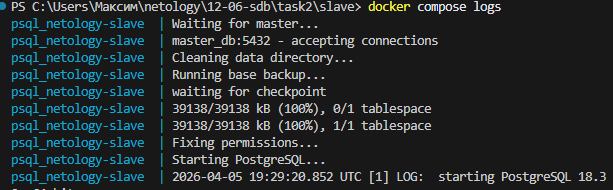
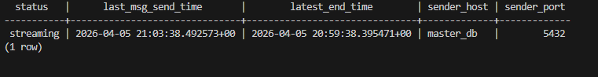
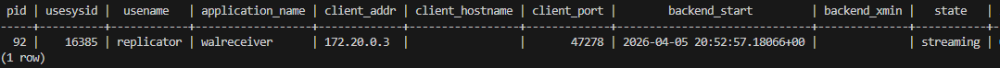

# Домашнее задание к занятию «Репликация и масштабирование. Часть 1» - Клочек Максим

### Инструкция по выполнению домашнего задания

### Задание 1

На лекции рассматривались режимы репликации master-slave, master-master, опишите их различия.

*Ответить в свободной форме.*

---

### Решение 1

---

В конфигурации master-slave, сервер master является основным и только на нём могут выполняются операции записи (доступен и для чтения), сервера slave выполняют только операции чтения и получают изменения с master. Такая конфигурация увеличивает скорость чтения из БД за счёт распределения нагрузки.

В конфигурации master-master, любой сервер может выполнять операции чтения и записи и синхронизировать данные с другими. Такая конфигурация более отказоустойчива, но возникают риски не согласованности данных

---

### Задание 2

Выполните конфигурацию master-slave репликации, примером можно пользоваться из лекции.

*Приложите скриншоты конфигурации, выполнения работы: состояния и режимы работы серверов.*

---

### Решение 2

---
1. Создаём сеть для контейнеров

 `docker network create pg-network`

2. Запускаем контейнера в папках 

 `docker compose up -d  `

3. Проверяем на slave

`docker compose logs`

4. Создаём базу 

`docker exec -it psql_netology-master psql -U postgres -c "CREATE DATABASE my_db;"`

`docker exec -it psql_netology-master psql -U postgres -d my_db -c "CREATE TABLE t1 (id INT);"`

на slave

`docker exec -it psql_netology-slave psql -U postgres -c "SELECT status,last_msg_send_time,latest_end_time,sender_host,sender_port   FROM pg_stat_wal_receiver;"`

на master

`docker exec -it psql_netology-master psql -U postgres -c "SELECT * FROM pg_stat_replication;"`

---

## Дополнительные задания (со звёздочкой*)
Эти задания дополнительные, то есть не обязательные к выполнению, и никак не повлияют на получение вами зачёта по этому домашнему заданию. Вы можете их выполнить, если хотите глубже шире разобраться в материале.

---

### Задание 3* 

Выполните конфигурацию master-master репликации. Произведите проверку.

*Приложите скриншоты конфигурации, выполнения работы: состояния и режимы работы серверов.*

---

### Решение 3

---

---